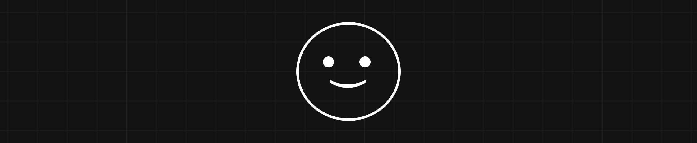

<h2 align="left">Hello World 🤖! I'm Cainã, a Brazilian Web Developer</h2>

###

###

  
  

###

###

  
  
  
  
  
  
  
  
  
  
  
  
  
  
  
  
  
  
  
  
  
  
  

###

  
  
  
  
  

###

 

<picture>
  <source media="(prefers-color-scheme: dark)" srcset="https://raw.githubusercontent.com/caiaikkj/caiaikkj/output/github-snake-dark.svg" />
  <source media="(prefers-color-scheme: light)" srcset="https://raw.githubusercontent.com/caiaikkj/caiaikkj/output/github-snake.svg" />
  
</picture>

###

  

###
